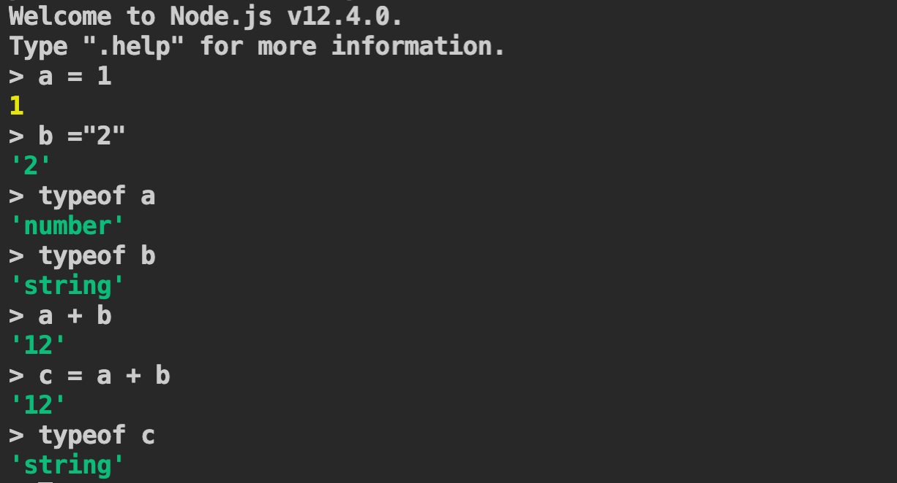
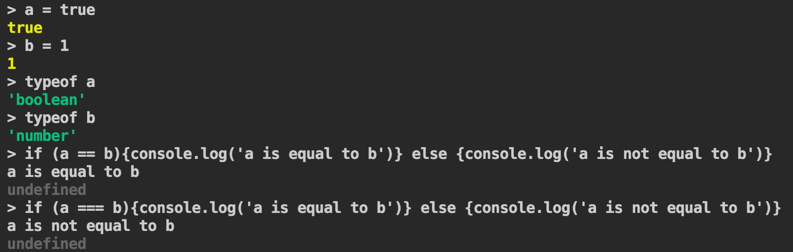

# T4A1 - Developer Workbook

## Questions and Answers

Q1 - Provide an overview and description of a standard source control process for a large project

Q2 - What are the most important aspects of quality software?

Q3 - Outline a standard high level structure for a MERN stack application and explain the components

MERN stack is a JavaScript stack built using MongoDB, Express, React and Node. The combination of these technologies provide a framework that makes the development process easier.

The web application is divided into frontend and backend. Frontend and Backend are separate and should have its own package.json.

**Frontend Components**

React is a powerful javascript framework to build interactive user interfaces. React is useful for single page and mobile applications with frequently changing data and it updates and renders only the components where data has changed. 

The components of React (javascript library) are :

Virtual DOM - VDOM is a programming 


**Backend Components**

MongoDB

Express

React

Q4 - A team is about to engage in a project, developing a website for a small business. What knowledge and skills would they need in order to develop the project?

Q5 - With reference to one of your own projects, discuss what knowledge or skills were required to complete your project, and to overcome challenges

Q6 - With reference to one of your own projects, evaluate how effective your knowledge and skills were for this project, and suggest changes or improvements for future projects of a similar nature

Q7 - Explain control flow, using an example from the JavaScript programming language

**Q8 - Explain type coercion, using examples from the JavaScript programming language**

**Answer:** Type coercion is the implicit conversion of data types. 

Examples:



In the above example a is of type number and b is of type string. Javascript has coerced a to a string and performed a concatenation operation when a + b was executed and returned a value of type string. Javascript can coerce primitive (number, string, boolean, null, undefined and symbol) or objects automatically. 

If the expected data type of the result of the operation a + b is a number, then an explicit data conversion is needed.


In the above example, a function Number is called to explicitly convert string data type to a Number.



In the above example, there is a difference between == operator and === operator. The == operator does an automatic or implicit type conversion and that is the reason a boolean value and number value are equal. The === operator does not do an implicit type coercion. 

Please refer to page https://dorey.github.io/JavaScript-Equality-Table/unified/ by Dorey (GitHub name), who has put together all the false positives that can result from == operator because of type coercion. This is the main issue with Javascript type coercion. Though type coercion helps to write less code, it is always better to write explicit type conversion in code to avoid any defects.  

Q9 - Explain data types, using examples from the JavaScript programming language

Q10 - Explain how arrays can be manipulated in JavaScript, using examples from the JavaScript programming language

Q11 - Explain how objects can be manipulated in JavaScript, using examples from the JavaScript programming language

Q12 - Explain how JSON can be manipulated in JavaScript, using examples from the JavaScript programming language

**Answer:** 

Q13 - For the code snippet provided below, write comments for each line of code to explain its functionality. In your comments you must demonstrates your ability to recognise and identify functions, ranges and classes

###### Answer: Code Snippet with comments

JSDoc tags were used to comment the code snippet. 

The generated javascripts in html can be found in the below <a href="./docs/out">here</a>.

Reference: https://www.npmjs.com/package/jsdoc

```javascript
/**
  * A class (special function in JavaScript) representing a Car.
  **/
 class Car {
    /**
      * Creates a Car and initialises the carname with Brand name. 
      * The value of this will be new Object when the Object of 
      * type Car is created. It is a constructor function.
      * @param {string} brand Brand of the Car
      */
    constructor(brand) {
        // When the new Object is created, the property carname 
        // will be assigned the brand name
        this.carname = brand; 
    }

    /**
      * A method (function in a class) to return the carname that the Object has been assigned.
      * 
      * @returns {string} A statement is returned with the value of Object's property carname 
      */
    present() {
        //return concatenated string with carname
        return 'I have a ' + this.carname; 
    }
}

/**
  * A class (special function) representing a Model of a Car and is properties 
  * and methods are inherited from Car.
  * @extends Car Inherited to take the properties of Car
  */
class Model extends Car {
    /**
      * Creates a Model, initialises the superclass with brand and initilises 
      * the new property mod (Model of Car) It is a constructor function.
      * @param {string} brand Brand of the car
      * @param {string} mod Model of the car (Year)
      */
    constructor(brand, mod) {
        // calls the parent's (Car class) constructor function to initialise and get access to properties
        super(brand); 
        // When the new Object is created, mod parameter is assigned to model property
        this.model = mod; 
    }
    /**
      * A method (function in a class) used to get the brand and the model
      * @returns {string} A concatenated string with brand and model
      */
    show() {
        // returns a concatenated value with a string value from 
        // inherited method and model property value of the Object (Model)
        return this.present() + ', it was made in ' + this.model;
    }
}
    
    // Array of car brands
    // index range of 0 to 2 (length of array is 3)
    let makes = ["Ford", "Holden", "Toyota"] 
    
    // Creates an array for 40 elements with each index
    // assigned a value of 1980 + current index
    // The array is initialized with undefined, 
    // so the value of x will be undefined
    // index range of 0 to 39 (length of array is 40)
    let models = Array.from(new Array(40), (x,i) => i + 1980) 

    /**
      * 
      * @param {number} min lowest possible value of the random number
      * @param {number} max highest possible value of the random number
      * 
      * @returns {number} a random number greater than or equal to min and less than or equal to max 
      */
    function randomIntFromInterval(min,max) { // min and max included
        // Math.random() returns a number less than zero
        // Math.random() multiplied by a number will return a number greater 
        // or less than zero and a floor on number rounds the number down
        return Math.floor(Math.random()*(max-min+1)+min);
    }

    // iterate each element in models array and print 
    // car brand and models as a random combination
    for (model of models) {

        // selects an element(string make(brand)) in the makes array at a random index
        // random index is determined by calling function randomIntFromInterval using
        // the count of number of elements in the makes array
        make = makes[randomIntFromInterval(0,makes.length-1)] 
        // selects an element(string model) in the models array at a random index
        // random index is determined by calling function randomIntFromInterval using
        // the count of number of elements in the makes array
        model = models[randomIntFromInterval(0,makes.length-1)] 

        mycar = new Model(make, model); // Create a new Model object with make(brand) and model
        console.log(mycar.show()) // Prints/Logs the car brand and model to console
    }
```


