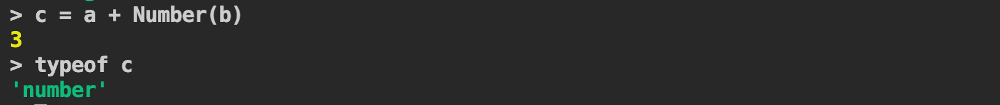

# T4A1 - Developer Workbook

## Questions and Answers

**Q1 - Provide an overview and description of a standard source control process for a large project**

**Answer:**

A standard source control process will include a very good version control system. Git is a highly recommended version control system to use for a large project.

Very large projects in the banking and telcommunications industry have development teams spread all over the world. If a project has development teams in Sydney, Singapore, London and New York working on different modules of an application, then it will be better to have four feature branches from a Mono Repo. That is a large single repository for all code including frontend/ backend with four feature branches created from the main development branch.

All the feature branches will not be merged to the main development branch all at once, because of the schedules of different feature delivery. This mandates the update of the feature branches when the main development branch is modified due to release by one of the teams. Tags can be used when this happens, so that the other teams can merge the latest changes from the development branch to their feature branch. This is important to resolve any merge conflicts and any related functionality changes early to resolve. Some of these changes may require working with other teams and non development teams. 

If Continous Integration (CI) is in place to push the changes in development branch to a preproduction test environment for automation testing, then it is better to preproduction branch. The code in preproduction branch will be picked up by the hourly or nightly builds and tested on preproduction or another test environment. 

All the top of these there would be a release branch which is code pushed from preproduction branch and is ready to be deployed to production. 

All local repositories on developers machine should be updated (pull) frequently from the appropriate branch to avoid spending too much time towards the end of a development sprint in resolving merge conflicts.

**Q2 - What are the most important aspects of quality software?**

**Answer:** 

The following are the most important aspects of a quality software.

1. The software should pass a security code scan. This will ensure that it is free from vulnerabilities.
2. Performance of software is very important. The execution should not be slow, as this can lead to exhaustion of resources and crashing of the application.
3. The software should be fit for purpose. If the software is a custom build application for organisation, then it should meet all requirements. 
4. The software should not produce any unexpected outcomes. It mostly happens when the code build for a totally unrelated industry is modified to fit for another purpose. For example, modifying a telco software and using it in banking.
5. The modern software should be test driven. This is not just a requirement due to CI/CD popularity, but also to avoid changes that will break existing functionality. 
6. The software should use good design patterns. For example if there are parameters to be loaded from a file that does not change often, then a Singleton pattern is more appropriate, so that there is no constant loading of the files.
7. The code should be well documented using the standards, the code should be modular or at the basic level, the code should be easy to understand. 
8. A good directory structure should be used to avoid any confusion. Most programming languages use packages, and bad directory structure is confusing and prone to defects.  
9. All the changes should be managed in a good project management tool like Jira, which helps to link sprints, to requirements and code. Changes should be traceable. Though this is not direcly linked to quality, it helps to develop quality software.
10. Similar to Point 9, there should be a good source control process in place to avoid any bad code in software. 

**Q3 - Outline a standard high level structure for a MERN stack application and explain the components**

**Answer:**

MERN stack is a JavaScript stack built using MongoDB, Express, React and Node. The combination of these technologies provide a framework that makes the development process easier. Developers who work on all components of a MERN stack are called full stack developers.

The web application is divided into frontend and backend. Frontend and Backend are separate and should have its own package.json. In git, it is better to use Mono Repos though frontend and backend are deployed separately. 

**Frontend Components**

**React** is a powerful javascript framework to build interactive user interfaces. It can manage the events and states very well. React is useful for single page applications and mobile applications with frequently changing data and it updates and renders only the components where data has changed. React uses Virtual DOM which is a copy of the DOM, to work out the components to be rendered.

**Backend Components**

**MongoDB** is a NOSQL or a Document database used for storing data as objects. MongoDB is scalable and flexible. It is the most popular no-sql database and works very well with Node. MongoDB works very well with Mongoose which is a Object Data Modelling library which manages relationship between the objects in the code and the objects in database. It also does schema validation.

**Express** is a flexible scalable Node web application framework. The API's(web) are developed using this Express. React front end calls the API's to process all types of HTTP requests. Express framework makes the development of API's easy by providing the components.

**Node** is a JavaScript runtime platform to easily build fast and scalable applications. It is very good for processing large volumes of data in real time. It works very well with the other components of the MERN stack.

**Q4 - A team is about to engage in a project, developing a website for a small business. What knowledge and skills would they need in order to develop the project?**

**Answer:**

The following knowledge and skills are required to develop a website for a small business.

1. Every member of the team should understand the statement of work. Statement of work is a subset of contract that will list all the components that are developed, the standards required by the team and the supporting document that should be delivered to the client. The supporting documentation would be architecture diagram, database design, and test plan. This helps the clients to review the costs and other concerns related to data.
2. All developers should have a good understanding of the requirements, modules, assigned work and schedule. They should also have the coding standards to be used, like variable naming, code comment requirement, module requirement etc. Understanding the requirement is important to avoid getting distracted and developing something that will not be paid for by the client, as it is not fit for purpose.
3. All developers should have the unit test requirements for their code. 
4. All developers should have a good understanding of the source control process and follow it.
5. Finally the developers and others should have knowledge and skills required to build code on platform using the agreed programming language. If the skills are missing, then there should be time in schedule allocated for training. It is important for Architects, Designers, Technical Analysts and other non admin staff involved in the project to understand technologies used in order to understand the limitations and advantages and design solutions with limitations and advantages in mind. 

**Q5 - With reference to one of your own projects, discuss what knowledge or skills were required to complete your project, and to overcome challenges**

**Answer:**

I worked on a project for developing a billing solution for a client. I was a technical analyst, so the knowledge and skills required are slightly different to developer.  The following knowledge and skills was required to complete the project and overcome challenges.

1. Understanding the Architecture and requirement to develop solution design for sub system.
2. Getting the tools required to draw designs like workflow designs and learning to use them.
3. Understanding the version control system to add these designs and documentation to version control system.
4. Understanding the technologies and system, to access database and other servers to workout required configuration to support testing teams.
5. Using confluence and jira to assign work to offshore developers and provide requirements and other information for their unit of work.  

**Q6 - With reference to one of your own projects, evaluate how effective your knowledge and skills were for this project, and suggest changes or improvements for future projects of a similar nature**

**Answer:**

I worked on a project for developing a billing solution for a client as mentioned in Question 5. My knowledge of the requirements was very good. But my understanding of the underlying technology used in the project was not very good. I was a technical analyst on the project. Though working on the code was not part of my responsibilities, I believe it would have helped to speed things up while working and supporting the testers. It would have helped me to understand the blocks of code that was causing the issue and point developers to the block of code that is causing the issue. This could be good or bad thing to do, i.e. interfering in the work of developers. Sometimes, understanding the code also helps in getting the configuration right for improving the performance during performance testing of the system. If there are dependencies on other team members, it delays the whole process. 

The changes I am doing to improving my skills is learning to code again in all the recent software and technologies. I believe this will help me be less dependent on development teams to understand code and improve resolution times of defects and configuration changes.   

**Q7 - Explain control flow, using an example from the JavaScript programming language**

**Answer:**

Control flow is the order in which the statement or functions are executed. JavaScript provides control flow statements to control the execution of blocks of code. 

**Conditional Statement**

If..then..else, for, while and switch are conditional statements provided by JavaScript. Depending on the condition being true or false, a block of code is executed. If there are special cases where a for or while loop has to terminated, then a break statement can be used. Similarly a continue statement can be used, if there is something additional to be executed and then the loop has to be continued. A switch statement can compare a value to multiple cases and execute the required statements. 

The code below has examples of conditional statements. 

```javascript
let a  = 1;
let b = 3;
if (a < b){
    for (let i=0; i< 10; i++){
        console.log(i);
        if(i == 5){
            console.log("i is 5, so breaking");
            break;
        } 
    }
}

let c = 5;
let k = 0;
if (c > a){
    while (k < 5){
        console.log(k);
        if (k == 3){
            console.log("Woohoo!");
            k += 2;
            continue; //it will not execute k++;
        }
        k++;
    }
}

let market = 'Coles';
switch (market) {
    case 'Coles':
        console.log('Coles');
        break;
    case 'Woolwoths':
        console.log('Woolwoths');
        break;
    case 'Aldi':
        console.log('Aldi');
        break;
    default:
        console.log(`we have not heard of this market ${market}.`);
}


```

**Exception Handling Statements**

try, catch and finally are control flow statements. If there is an exception thrown in a block of code the next block of code executed is within the catch block. Finally block is always executed.

The code below is a basic example of control flow using exception handling statements. 

```javascript
try {
  throw "This is created exception!";
} catch(e) {  
  handleError(e); 
} finally {
  handleFinally(); 
}

function handleError(e){
    console.log(e);
}

function handleFinally(){
    console.log("In finally!");
}
```


**Q8 - Explain type coercion, using examples from the JavaScript programming language**

**Answer:** Type coercion is the implicit conversion of data types. 

Examples:


In the above example a is of type number and b is of type string. Javascript has coerced a to a string and performed a concatenation operation when a + b was executed and returned a value of type string. Javascript can coerce primitive (number, string, boolean, null, undefined and symbol) or objects automatically. 

If the expected data type of the result of the operation a + b is a number, then an explicit data conversion is needed.



In the above example, a function Number is called to explicitly convert string data type to a Number.


In the above example, there is a difference between == operator and === operator. The == operator does an automatic or implicit type conversion and that is the reason a boolean value and number value are equal. The === operator does not do an implicit type coercion. 

Please refer to page https://dorey.github.io/JavaScript-Equality-Table/unified/ by Dorey (GitHub name), who has put together all the false positives that can result from == operator because of type coercion. This is the main issue with Javascript type coercion. Though type coercion helps to write less code, it is always better to write explicit type conversion in code to avoid any defects.  

**Q9 - Explain data types, using examples from the JavaScript programming language**

**Answer:**

There are six main primitive data types in JavaScript. There is another primitive data type called BigInt supported by some browsers. There is one complex data type called object in JavaScript that can have other primitive data types or objects .

The following are the basic data types in JavaScript - 

1. number - Used for numbers of any type (Primitive) A number can represent integers and floating point numbers. All mathematical operations like add(+), subtract(-), multiply(*), division(/) etc are possible using number data type. JavaScript can store Infinity as shown in the code below. If there is an error while trying to divide String by Number, then it is represented by NaN.

   ```javascript
   c = 3.14;
   console.log(typeof c); //number
   
   a = 1/0;
   console.log(a); // Infinity
   
   b = "Test"/1;
   console.log(b); // NaN
   ```

2. string - Used for one or more characters  (Primitive). Strings have quotes around them. In JavaScript, double quotes, single quotes and back ticks can be used. Back ticks allows to use variables and expressions in strings.

   ```javascript
   a = "Hello";
   b = 'Hi';
   c = `The ways to greet ${2 + 4} people is ${a}, ${b}.`
   console.log(c); //The ways to greet 6 people is Hello, Hi.
   ```

3. boolean - Used for true/false  (Primitive) Boolean is used to store correct/incorrect or yes/no values.

   ```javascript
   yes = 6 > 3;
   console.log(yes); //true
   no = 9 > 18;
   console.log(no); //false
   ```

4. null - Used for unknown values  (Primitive) In JavaScript null does not represent Null Pointer like other languages. 

   ```javascript
   r = null;
   console.log(r); //null
   ```

5. undefined - Used when values are not assigned to variable  (Primitive) It is a type of its own.

   ```javascript
   let r;
   console.log(r); //undefined
   console.log(typeof r); //undefined
   ```

6. object - Used for complex data structures (Complex) Objects are used to store collection of entities. They have properties which is a key value pairs. The keys are strings and values can be simple or complex types. Objects can be manipulated. 

   ```javascript
   person = {
       name: "Parrot",
       location: "Zoo",
       country: "Zooland"
   };
   
   console.log(person); //{ name: 'Parrot', location: 'Zoo', country: 'Zooland' }
   console.log(person.name); //Parrot
   
   //change value of property
   person["name"] = "Zebra";
   
   //delete a property
   delete person.location;
   console.log(person);
   ```

7. symbol - Used for unique identifiers (Primitive)  Symbols can be used to assign unique identifiers to properties of object. When multiple objects are created like the one below, unique values can be assigned using Symbol.

   ```javascript
   id = Symbol("id");
   id1 = Symbol("id");
   
   bool_sym = id === id1; //their descriptions are same but they are unique.
   
   console.log(id);//Symbol(id)
   console.log(id1);//Symbol(id)
   
   console.log(bool_sym);
   
   person = {
       name: id,  //Symbol used
       location: "Zoo",
       country: "Zooland",
   };
   
   console.log(person); //{ name: Symbol(id), location: 'Zoo', country: 'Zooland' }
   console.log(person.name); //Symbol(id)
   ```

   

**Q10 - Explain how arrays can be manipulated in JavaScript, using examples from the JavaScript programming language**

**Answer:**

Unlike other languages, Arrays are a single variable in JavaScript that can store multiple items. 

JavaScript provides the following functions to manipulate arrays. They are very easy to use. 

toString(), join(), concat(), push(), pop(), shift(), unshift(), splice(), slice(), split(), indexOf(), lastIndexOf(), filter(), map(), reduce(), forEach(), every(), some(), includes()

Map, Reduce, Filter and ForEach are very useful methods to manipulate data with very little code. 

```javascript
let myArray = ['Sydney', 11, true];

//toString() - converts array to comma separated string.
console.log(myArray.toString()); // Sydney,11,true

//join() - converts array to string with a separator.
console.log(myArray.join('-')); //Sydney-11-true

//concat() - merges two arrays together
let myArray2 = [1,2,3];
console.log(myArray.concat(myArray2)); //[ 'Sydney', 11, true, 1, 2, 3 ]

//push() - Adds items to end of the array and modifies the array.
myArray2.push('A','B','C');
console.log(myArray2); //[ 1, 2, 3, 'A', 'B', 'C' ]

//pop() - Removes the last item of the array
myArray2.pop();
console.log(myArray2);//[ 1, 2, 3, 'A', 'B' ]

//shift() - Removes the first item of the array
myArray2.shift();
console.log(myArray2);//[ 2, 3, 'A', 'B' ]

//unshift() - Adds an item to the beginning of the array
myArray2.unshift(1);
console.log(myArray2);//[ 1, 2, 3, 'A', 'B' ]

//splice() - Changes an array by removing and adding elements.
myArray2.splice(0,3,4,5,6);
console.log(myArray2);//[ 4, 5, 6, 'A', 'B' ]

//slice() - Returns a subarray of array. The original array is not modified.
console.log(myArray2.slice(0,3));//[ 4, 5, 6 ]

//split() - Splits a string and returns an array
console.log("Coder".split(''));//[ 'C', 'o', 'd', 'e', 'r' ]

//indexOf() - Returns the index of an item in array, if not found returns -1.
console.log(myArray2.indexOf('A')); //3

//lastIndexOf() - Returns the last index of item (it is possible to have duplicate items in array).
myArray3 = [1,2,3,100,12,100];
console.log(myArray3.lastIndexOf(100)); //5

//filter() - Returns an array if a condition passes on items of array.
console.log(myArray3.filter(num => num === 12));//[ 12 ]

//map() - Used to manipulate the existing array
console.log(myArray3.map(num => {return '$' + num;}));

//reduce() - Calculates the total
const sum = myArray3.reduce((total, value) =>
total + value, 0);
console.log(sum);

//forEach() - Used to iterate the array items.
myArray3.forEach((item, i) => console.log(i, item));
//Output
//0 1
//1 2
//2 3
//3 100
//4 12
//5 100

//every() - Checks if all items satisfies a condition.
console.log(myArray3.every((value) => {
    return value >= 90;
    })); //false

//some() - Checks if some items satisfies a condition.
console.log(myArray3.some((value) => {
    return value >= 90;
    })); //true

//includes() - Checks if an array contains a specific item.
console.log(myArray3.includes(12)); //true


```

The above code are examples of using array manipulation script in JavaScript. 


**Q11 - Explain how objects can be manipulated in JavaScript, using examples from the JavaScript programming language**

**Answer:**

In JavaScript, Objects are key value pairs, where values can be primitive data types, Objects and functions. The important property to notice is \__proto__. Every Object in JavaScript has a link (\__proto__) to prototype and prototype has a prototype of its own. This is the mechanism used for object inheritance in JavaScript. It is called Prototypical/Prototype inheritance.  

Prototypes are important part of object manipulation. 

The below code is a simple object literal with key values and one of the values is a function. 

```javascript
//object literal
const lion = {
    type: "Carnivore",
    home: "Africa",
    whoAmI: function() {
        return `I am a ${this.type} from ${this.home}`;
    }
};

console.log(lion.whoAmI());
console.log(Object.keys(lion));
console.log(Object.values(lion));

/**
 * ====================
 * output 
 * ====================
 * I am a Carnivore from Africa
 * [ 'type', 'home', 'whoAmI' ]
 * [ 'Carnivore', 'Africa', [Function: whoAmI] ]
 */


```

To manipulate the above object, we can simply assign values using the keys in the object. There are two ways of assigning values using keys as shown below. This only changes the lion object. 

```javascript
lion.type = "Herbivore";
lion["home"] = "South Africa";
console.log(`Changed Lion: ${lion.type} ${lion.home}`);
console.log(lion.whoAmI());

/**
 * -----------
 * Output
 * -----------
 * Changed Lion: Herbivore South Africa
 * I am a Herbivore from South Africa
 */
```

Using object literal is not really efficient, as we have to repeat the properties in every object of the same type that have common properties. . 

A more efficient way to do this would be to define a constructor that can be used as prototype for all objects. The example below defines a Animal prototype and creating two objects from the prototype. 

```javascript
// Constructor before and after ES5, ES6 uses classes but under the hood it still works the same way
function Animal(type, home){
    this.type = type;
    this.home = home;
    this.myProfile = function() {
        return `I am a ${this.type} from ${this.home}`;
    }
}

//instantiating object
const tiger = new Animal("Carnivore","India");
const zebra = new Animal("Herbivore", "Africa");

console.log(zebra);

/**
 * ===================
 * Output
 * ===================
 * Animal { type: 'Herbivore', home: 'Africa', myProfile: [Function] }
 */


```

The above objects were created from Prototype Animal, but if there is a requirement to add new properties to all objects created, then the best way to do it is add this property to the prototype. In the example below, the object was manipulated to include a new property bloodType. 

```javascript
Animal.prototype.whoAmI = function() {
    return `I am a ${this.type} from ${this.home}`;
};

Animal.prototype.addBloodType = function(bloodType) {
    this.bloodType = bloodType;
};

zebra.addBloodType("Warm");

console.log(zebra);
console.log(zebra.whoAmI());

/**
 * ==================
 * Output
 * ==================
 * Animal {
 * type: 'Herbivore',
 * home: 'Africa',
 * myProfile: [Function],
 * bloodType: 'Warm'
 * }
 * I am a Herbivore from Africa
 
 */


```

The other way adding more properties to an object is inheritance. Inheritance has the additional capability of overriding the constructor. This will allow adding additional properties at the time of creation. 

```javascript
//Inheriting Animals in LandAnimal
function LandAnimal(type, home, temperature){
    Animal.call(this, type, home);
    this.temperature = temperature;
}

//inherit prototype
//creates a new object with existing object as prototype
LandAnimal.prototype = Object.create(Animal.prototype);

//Use the LandAnimal constructor
LandAnimal.prototype.constructor = LandAnimal;

//instantiation
const bear = new LandAnimal("Carnivore","Canada",5);


console.log("Profile: " + bear.myProfile());
console.log("Who am I: " + bear.whoAmI());

/**
 * =============
 * Output
 * ==============
 * Profile: I am a Carnivore from Canada
 * Who am I: I am a Carnivore from Canada
 */


```

The syntax used above is ES5. Though ES6 uses classes, it still works in the same way as ES5 under the hood. This explains why objects are functions under the hood.

The below example shows a ES6 class.

```javascript
//ES6 - Syntactic sugar - same as ES5
class SeaBeing {
    constructor(name, type){
        this.name = name;
        this.type = type;
    }
    whoAmI() {
        return `I am a ${this.name} from ${this.type}`;
    }
    static aboutMe(){
        return 'Iam a sea being';
    }
}

//Instantiate Object
const whale = new SeaBeing('Big', 'Mammal');
console.log(whale);

/**
 * ===========
 * Output
 * ===========
 * SeaBeing { name: 'Big', type: 'Mammal' }
 */


```

As shown in the JavaScript code below, ES6 makes the constructor override easier by using super.

```javascript
//subclass (inheritance)
class Fish extends SeaBeing {
    constructor(name, type, size){
        super(name, type);
        this.size = size;
    }
}

//Instantiate
const shark = new Fish('Bull', 'Not a Mammal', 'Large');
console.log(shark.whoAmI());

/**
 * =============
 * Output
 * =============
 * I am a Bull from Not a Mammal
 */
```

JavaScript provides powerful objects framework with several to manipulate them individually using keys and values or by changing the prototypes to manipulate all instances or using inheritance to apply it to newly created objects. 


**Q12 - Explain how JSON can be manipulated in JavaScript, using examples from the JavaScript programming language**

**Answer:** 

There are two main functions available in Javascript to manipulate JSON. They are parse and stringify.

Parse converts JSON to Javascript Object. Stringfy converts Object to a JSON string. 

The following code samples are examples of JSON manipution using javascript.

1. Parsing JSON

   In the following example, a json string in parsed to a javascript object and the properties of the object are printed on the console. 

```javascript
/**
 * Parsing JSON
 */

// city data in json format
let city = '{"name": "Sydney", "state": "NSW", "postcode": 2000}';

// converting city to a javascript object
let cityObj = JSON.parse(city);

// accessing properties of the json object
console.log(cityObj.name); 
console.log(cityObj.state); 
console.log(cityObj.postcode); 

/**
 * ------------
 * Output
 * ------------
 * Sydney
 * NSW
 * 2000
 */


```


2. Parsing complex JSON

   In the following example, JSON string is complex with arrays, and inner json objects. Javascript can handle these complexities easily as shown in the example below.

```javascript
/* Complex JSON Object */
let city_suburbs = `{
    "Sydney": {
        "suburbs": ["Newtown", "Bondi", "North Sydney"],
        "postcode": {
            "Newtown": "2045", "Bondi": "2010", "North Sydney": "2060"
        }
    }
}`;

// parse json object
citySuburbObj = JSON.parse(city_suburbs);

// print properties
function print(complexObj) {
    for(let i in complexObj) {
        if(complexObj[i] instanceof Object) {
            //console.log("Type of Object", typeof complexObj[i]);
            print(complexObj[i]);
        } else {
            console.log(complexObj[i]);
        };
    }
};

// print all values from city suburb Object
print(citySuburbObj);

/**
 * -----------
 * Output
 * -----------
 * Newtown
 * Bondi
 * North Sydney
 * 2045
 * 2010
 * 2060
 * 
 */


```


3. Converting Javascript Object to JSON string

   In the following example, a JSON object is converted to a String.

```javascript
// Data Encoding - Converting object to JSON String 

// Object
let suburbObj = {"name": "Newtown", "population": 25000, "postcode": "2045"};

// Converting object to JSON string
let json = JSON.stringify(suburbObj);
console.log(json);

/**
 * ---------
 * Output
 * ---------
 * {"name":"Newtown","population":25000,"postcode":"2045"}
 */


```


4. Converting Array to JSON String

In the following example, an array is converted to a JSON string.

```javascript
// Data Encoding - Converting array to JSON string

// array
let suburbArray = ["Sydney", "Newtown", "Pertersham", "Ashfield", "Burwood"];

// Convert array to JSON string
let jsonString = JSON.stringify(suburbArray);
console.log(jsonString);

/**
 * -------------
 * Output
 * -------------
 * ["Sydney","Newtown","Pertersham","Ashfield","Burwood"]
 */
```


**Q13 - For the code snippet provided below, write comments for each line of code to explain its functionality. In your comments you must demonstrates your ability to recognise and identify functions, ranges and classes**

###### Answer: Code Snippet with comments

JSDoc tags were used to comment the code snippet. 

The generated javascripts in html can be found in the below <a href="./docs/out">here</a>.

Reference: https://www.npmjs.com/package/jsdoc

```javascript
/**
  * A class (special function in JavaScript) representing a Car.
  **/
 class Car {
    /**
      * Creates a Car and initialises the carname with Brand name. 
      * The value of this will be new Object when the Object of 
      * type Car is created. It is a constructor function.
      * @param {string} brand Brand of the Car
      */
    constructor(brand) {
        // When the new Object is created, the property carname 
        // will be assigned the brand name
        this.carname = brand; 
    }

    /**
      * A method (function in a class) to return the carname that the Object has been assigned.
      * 
      * @returns {string} A statement is returned with the value of Object's property carname 
      */
    present() {
        //return concatenated string with carname
        return 'I have a ' + this.carname; 
    }
}

/**
  * A class (special function) representing a Model of a Car and is properties 
  * and methods are inherited from Car.
  * @extends Car Inherited to take the properties of Car
  */
class Model extends Car {
    /**
      * Creates a Model, initialises the superclass with brand and initilises 
      * the new property mod (Model of Car) It is a constructor function.
      * @param {string} brand Brand of the car
      * @param {string} mod Model of the car (Year)
      */
    constructor(brand, mod) {
        // calls the parent's (Car class) constructor function to initialise and get access to properties
        super(brand); 
        // When the new Object is created, mod parameter is assigned to model property
        this.model = mod; 
    }
    /**
      * A method (function in a class) used to get the brand and the model
      * @returns {string} A concatenated string with brand and model
      */
    show() {
        // returns a concatenated value with a string value from 
        // inherited method and model property value of the Object (Model)
        return this.present() + ', it was made in ' + this.model;
    }
}
    
    // Array of car brands
    // index range of 0 to 2 (length of array is 3)
    let makes = ["Ford", "Holden", "Toyota"] 
    
    // Creates an array for 40 elements with each index
    // assigned a value of 1980 + current index
    // The array is initialized with undefined, 
    // so the value of x will be undefined
    // index range of 0 to 39 (length of array is 40)
    let models = Array.from(new Array(40), (x,i) => i + 1980) 

    /**
      * 
      * @param {number} min lowest possible value of the random number
      * @param {number} max highest possible value of the random number
      * 
      * @returns {number} a random number greater than or equal to min and less than or equal to max 
      */
    function randomIntFromInterval(min,max) { // min and max included
        // Math.random() returns a number less than zero
        // Math.random() multiplied by a number will return a number greater 
        // or less than zero and a floor on number rounds the number down
        return Math.floor(Math.random()*(max-min+1)+min);
    }

    // iterate each element in models array and print 
    // car brand and models as a random combination
    for (model of models) {

        // selects an element(string make(brand)) in the makes array at a random index
        // random index is determined by calling function randomIntFromInterval using
        // the count of number of elements in the makes array
        make = makes[randomIntFromInterval(0,makes.length-1)] 
        // selects an element(string model) in the models array at a random index
        // random index is determined by calling function randomIntFromInterval using
        // the count of number of elements in the makes array
        model = models[randomIntFromInterval(0,makes.length-1)] 

        mycar = new Model(make, model); // Create a new Model object with make(brand) and model
        console.log(mycar.show()) // Prints/Logs the car brand and model to console
    }
```


